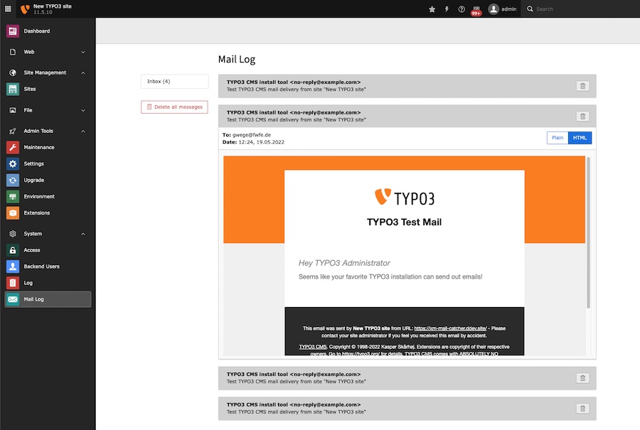

# Mail Catcher

This TYPO3 extension adds a module to view emails that were printed to file.

**Requirements**: Python & 1 free Port



## Installation

```
composer require xima/xm-mail-catcher
```

## Configuration

To prevent TYPO3 from sending emails, start a fake SMTP server on the host machine with python:

```
python3 -u -m smtpd -n -c DebuggingServer localhost:2500 >> /var/www/html/var/log/mail.log & 2> /dev/null
```

Configure TYPO3 to use the local SMTP server:

```
$GLOBALS['TYPO3_CONF_VARS']['MAIL']['transport'] = 'smtp'
$GLOBALS['TYPO3_CONF_VARS']['MAIL']['transport_smtp_server'] = 'localhost:2500'
```

Adjust the path of the log file in the extension configuration. 

```
$GLOBALS['TYPO3_CONF_VARS']['EXTENSIONS']['xm_mail_catcher']['logPath'] = '/var/log/mail.log'
```
